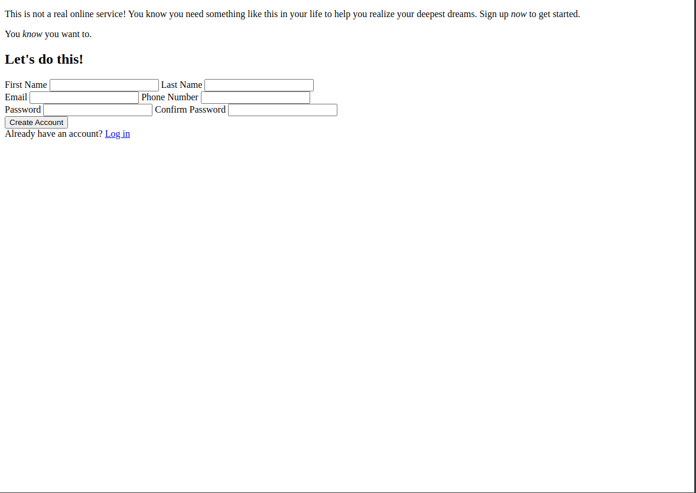
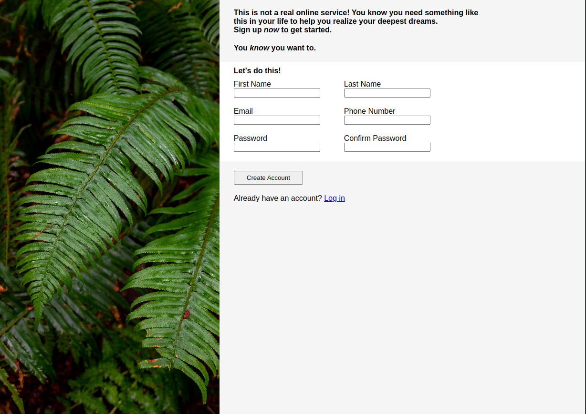
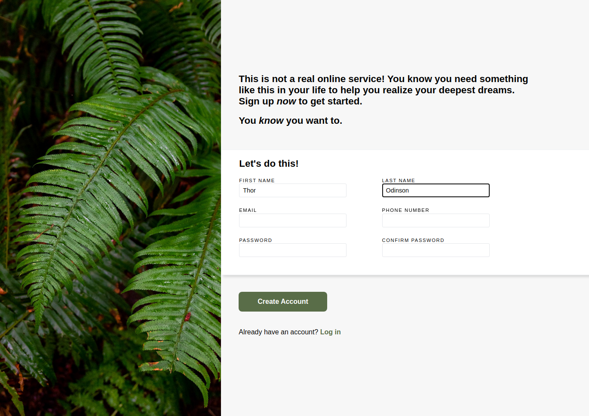
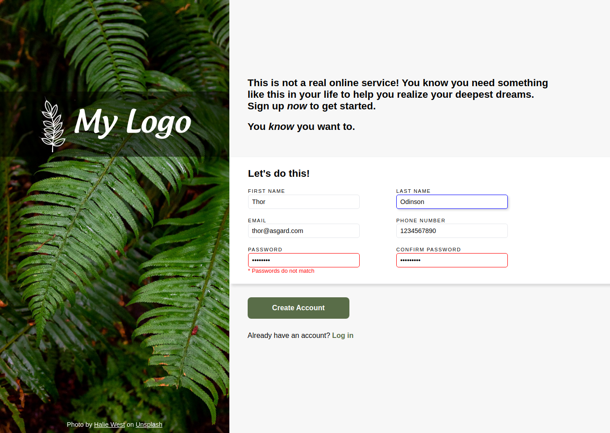

# Project "Sign-up Page"

## Task Description
Create a <i>responsive</i> sign-up page for an imaginary service. Use the following example as a general idea for the layout:

## Version 1 
Intitial version, an unstyled HTML file.

## Version 2 
Draft styling and an image.

## Version 3 
The main section is mostly styled.

## Version 4 
Sidebar: logo, custom font, and photo attribution.

## Version 5 
Form validation and styles.

